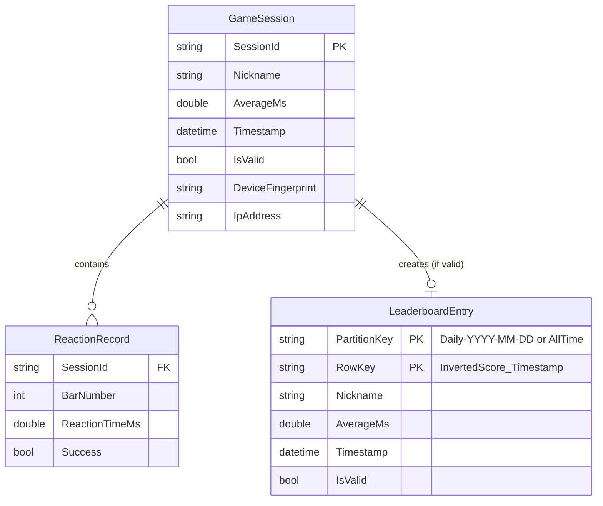

# Data Model: PoReflex Reaction Time Game

**Feature**: 001-reflex-game
**Date**: 2025-12-11

## Entity Relationship Diagram



## Entities

### GameSession (Client-Side Only)

Represents a single 6-bar playthrough. Exists only in browser memory during gameplay.

| Field | Type | Description | Validation |
|-------|------|-------------|------------|
| `SessionId` | `string` | GUID generated at game start | Auto-generated |
| `Nickname` | `string` | Player's chosen name | 1-15 letters (A-Z, a-z) |
| `Reactions` | `ReactionRecord[]` | Array of 6 individual bar results | Exactly 6 records |
| `AverageMs` | `double` | Mean of all 6 reaction times | Calculated; ≥100ms for valid |
| `StartedAt` | `DateTime` | When game began | Auto-captured |
| `CompletedAt` | `DateTime?` | When game ended (null if failed) | Auto-captured |
| `IsValid` | `bool` | True if all 6 bars stopped, avg ≥100ms | Derived |
| `DeviceFingerprint` | `string` | Browser/device signature for rate limiting | Generated client-side |

**Note**: `IpAddress` for rate limiting is extracted **server-side** from the HTTP request context in `SubmitScore.cs`, not from the client. The `ScoreSubmissionRequest` DTO does not include IP address.

**State Transitions**:
```
Created → InProgress → Completed → Submitted
                    → Failed (false start, timeout, or inhuman speed)
```

### ReactionRecord (Client-Side Only)

Individual bar result within a game session.

| Field | Type | Description | Validation |
|-------|------|-------------|------------|
| `BarNumber` | `int` | Bar index (1-6) | 1 ≤ n ≤ 6 |
| `ReactionTimeMs` | `double` | Time from stimulus to response | 0 < t ≤ 2000ms |
| `Success` | `bool` | True if bar stopped before timeout | Derived |
| `StimulusTimestamp` | `double` | `performance.now()` when bar started | High-precision |
| `ResponseTimestamp` | `double?` | `performance.now()` when stopped | Null if timeout |

### LeaderboardEntry (Azure Table Storage)

Persisted leaderboard record in Azure Table Storage.

| Field | Type | Table Storage Type | Description |
|-------|------|-------------------|-------------|
| `PartitionKey` | `string` | `PartitionKey` | `"Daily-YYYY-MM-DD"` or `"AllTime"` |
| `RowKey` | `string` | `RowKey` | Inverted score + timestamp for sort order |
| `Nickname` | `string` | `string` | Player's nickname |
| `AverageMs` | `double` | `double` | Average reaction time in milliseconds |
| `Timestamp` | `DateTime` | `DateTime` | When score was submitted |
| `IsValid` | `bool` | `bool` | Always true (invalid scores not stored) |

**RowKey Format**:
```
{10000000000 - (AverageMs * 10000):D13}_{Timestamp.Ticks:D19}
```
Example: For 215.5ms at timestamp 638695..., RowKey = `0009997845000_0638695...`

This format ensures:
1. Fastest scores sort first (lexicographic ascending on inverted score)
2. Ties broken by earliest timestamp (lower ticks = earlier)

## DTOs (Po.Reflex.Shared)

### ScoreSubmissionRequest

```csharp
public record ScoreSubmissionRequest(
    string Nickname,
    double AverageMs,
    double[] ReactionTimes,  // Array of 6 individual times
    string DeviceFingerprint
);
```

### ScoreSubmissionResponse

```csharp
public record ScoreSubmissionResponse(
    bool Success,
    int? DailyRank,
    int? AllTimeRank
);
```

### LeaderboardEntryDto

```csharp
public record LeaderboardEntryDto(
    int Rank,
    string Nickname,
    double AverageMs,
    DateTime Timestamp
);
```

### LeaderboardResponse

```csharp
public record LeaderboardResponse(
    string ViewType,  // "Daily" or "AllTime"
    List<LeaderboardEntryDto> Entries,
    DateTime? AsOf  // For Daily view: the date
);
```

### HealthStatusDto

```csharp
public record HealthStatusDto(
    bool IsHealthy,
    bool StorageConnected,
    string? ErrorMessage
);
```

## Validation Rules

### NicknameValidator (FluentValidation)

```csharp
public class NicknameValidator : AbstractValidator<string>
{
    public NicknameValidator()
    {
        RuleFor(x => x)
            .NotEmpty().WithMessage("Nickname is required")
            .Length(1, 15).WithMessage("Nickname must be 1-15 characters")
            .Matches("^[A-Za-z]+$").WithMessage("Nickname must contain only letters");
    }
}
```

### ScoreSubmissionValidator (FluentValidation)

```csharp
public class ScoreSubmissionValidator : AbstractValidator<ScoreSubmissionRequest>
{
    public ScoreSubmissionValidator()
    {
        RuleFor(x => x.Nickname).SetValidator(new NicknameValidator());
        
        RuleFor(x => x.AverageMs)
            .GreaterThanOrEqualTo(100)
            .WithMessage("Average reaction time below 100ms is not biologically possible");
        
        RuleFor(x => x.ReactionTimes)
            .NotNull()
            .Must(r => r.Length == 6)
            .WithMessage("Exactly 6 reaction times required");
        
        RuleForEach(x => x.ReactionTimes)
            .InclusiveBetween(0.05, 2000)
            .WithMessage("Individual reaction time must be between 0.05ms and 2000ms");
        
        RuleFor(x => x.DeviceFingerprint)
            .NotEmpty()
            .WithMessage("Device fingerprint required for rate limiting");
    }
}
```

## Storage Patterns

### Daily Partition Rollover

- Each day gets a new partition: `Daily-2025-12-11`, `Daily-2025-12-12`, etc.
- Old partitions can be pruned after 30 days to manage storage costs
- AllTime partition updated on every valid submission

### Query Patterns

| Query | Implementation |
|-------|----------------|
| Daily Top 10 | `PartitionKey eq 'Daily-{today}' and Take(10)` |
| All-Time Top 10 | `PartitionKey eq 'AllTime' and Take(10)` |
| Player's rank | Count entries with RowKey < player's RowKey |
