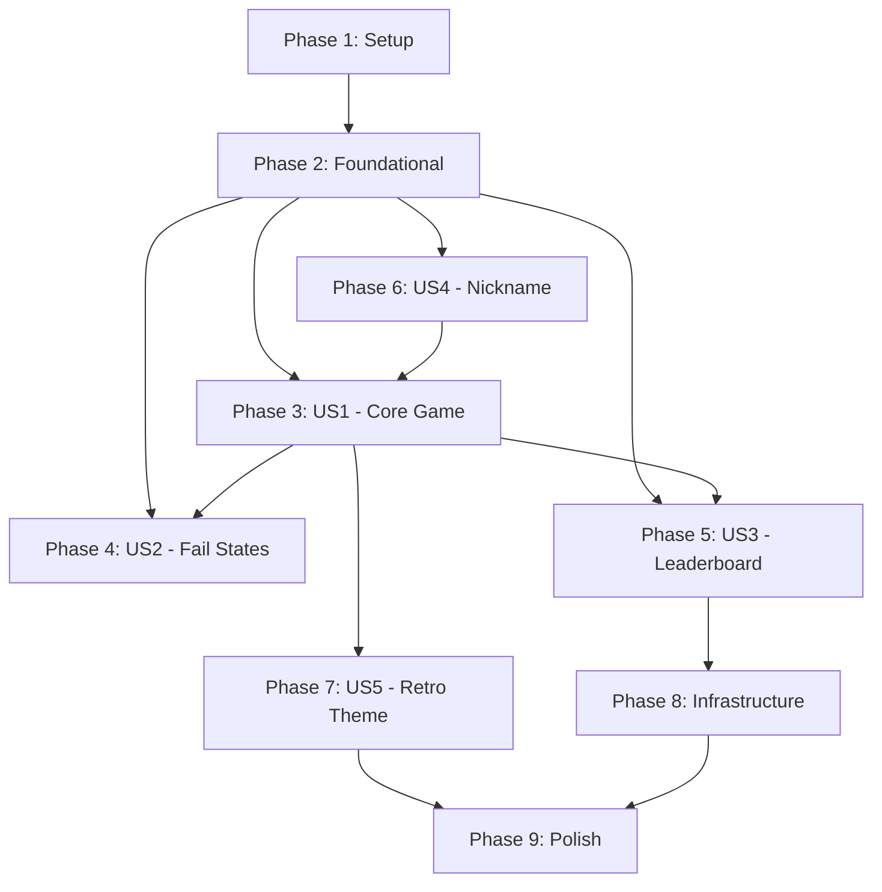

# Tasks: PoReflex Reaction Time Game

**Input**: Design documents from `/specs/001-reflex-game/`
**Prerequisites**: plan.md ✓, spec.md ✓, research.md ✓, data-model.md ✓, contracts/ ✓

**Tests**: Tests are included per constitution requirement (TDD workflow, 80% coverage, ≤50 tests total).

**Organization**: Tasks are grouped by user story to enable independent implementation and testing of each story.

## Format: `[ID] [P?] [Story?] Description`

- **[P]**: Can run in parallel (different files, no dependencies)
- **[Story]**: Which user story this task belongs to (e.g., US1, US2, US3)
- Include exact file paths in descriptions

## Path Conventions

- **API**: `src/Po.Reflex.Api/`
- **Client**: `src/Po.Reflex.Client/`
- **Shared**: `src/Po.Reflex.Shared/`
- **Tests**: `tests/Po.Reflex.*.Tests/`

---

## Phase 1: Setup (Shared Infrastructure)

**Purpose**: Project initialization, solution structure, and configuration

- [X] T001 Create solution file `PoReflex.sln` at repository root
- [X] T002 Create `global.json` locked to .NET 10.0.xxx SDK version
- [X] T003 Create `Directory.Packages.props` with centralized NuGet packages (MediatR, FluentValidation, Serilog, Azure.Data.Tables, xUnit, bUnit, Playwright)
- [X] T004 [P] Create `src/Po.Reflex.Api/Po.Reflex.Api.csproj` with `<Nullable>enable</Nullable>` and package references
- [X] T005 [P] Create `src/Po.Reflex.Client/Po.Reflex.Client.csproj` as Blazor WASM with `<Nullable>enable</Nullable>`
- [X] T006 [P] Create `src/Po.Reflex.Shared/Po.Reflex.Shared.csproj` as class library with `<Nullable>enable</Nullable>`
- [X] T007 [P] Create `tests/Po.Reflex.Api.Tests/Po.Reflex.Api.Tests.csproj` with xUnit references
- [X] T008 [P] Create `tests/Po.Reflex.Client.Tests/Po.Reflex.Client.Tests.csproj` with bUnit references
- [X] T009 [P] Create `tests/Po.Reflex.E2E/Po.Reflex.E2E.csproj` with Playwright references
- [X] T010 Create `.vscode/launch.json` with F5 debug configuration and `serverReadyAction`
- [X] T011 [P] Create `docs/README.md` with project description and setup instructions
- [X] T012 [P] Create `.editorconfig` for code style consistency

**Checkpoint**: Solution builds with `dotnet build` and all projects reference correctly

---

## Phase 2: Foundational (Blocking Prerequisites)

**Purpose**: Core infrastructure that MUST be complete before ANY user story can be implemented

**⚠️ CRITICAL**: No user story work can begin until this phase is complete

- [X] T013 Create `src/Po.Reflex.Api/Program.cs` with Minimal API setup, Swagger, Serilog, and Blazor WASM hosting
- [X] T014 Create `src/Po.Reflex.Api/appsettings.json` with Azurite connection string and Serilog configuration
- [X] T015 Create `src/Po.Reflex.Api/appsettings.Development.json` with debug logging
- [X] T016 Create `src/Po.Reflex.Api/Infrastructure/Middleware/ProblemDetailsMiddleware.cs` for RFC 7807 error responses
- [X] T017 Create `src/Po.Reflex.Api/Infrastructure/TableStorage/LeaderboardRepository.cs` with Azure Table Storage client setup
- [X] T018 Create `src/Po.Reflex.Client/Program.cs` with Blazor WASM initialization and HttpClient registration
- [X] T019 Create `src/Po.Reflex.Client/wwwroot/index.html` with `<title>PoReflex</title>` and canvas element
- [X] T020 [P] Create `src/Po.Reflex.Shared/DTOs/HealthStatusDto.cs` per data-model.md
- [X] T021 [P] Create `src/Po.Reflex.Shared/DTOs/ScoreSubmissionRequest.cs` per data-model.md
- [X] T022 [P] Create `src/Po.Reflex.Shared/DTOs/ScoreSubmissionResponse.cs` per data-model.md
- [X] T023 [P] Create `src/Po.Reflex.Shared/DTOs/LeaderboardEntryDto.cs` per data-model.md
- [X] T024 [P] Create `src/Po.Reflex.Shared/DTOs/LeaderboardResponse.cs` per data-model.md
- [X] T025 Create `src/Po.Reflex.Api/Features/Game/GetHealth.cs` with health check endpoint at `/api/health`
- [X] T026 Create `tests/Po.Reflex.Api.Tests/Integration/HealthEndpointTests.cs` with happy path test
- [X] T026b Create `src/Po.Reflex.Api/Infrastructure/Middleware/RateLimitingMiddleware.cs` with device fingerprint + IP address limiting (10 req/min per source) per FR-021

**Checkpoint**: API starts with `dotnet run`, Swagger available at `/swagger`, health check returns 200, rate limiting active

---

## Phase 3: User Story 1 - Play Core Reaction Game (Priority: P1) 🎯 MVP

**Goal**: Player can test reaction time by stopping 6 vertical bars as they grow upward

**Independent Test**: Launch app → enter nickname → play 6 bars → see average reaction time

### Tests for User Story 1

- [X] T027 [P] [US1] Create `tests/Po.Reflex.Client.Tests/Components/GameEngineInteropTests.cs` for JS interop contract
- [X] T027b [P] [US1] Add test to `GameEngineInteropTests.cs` verifying only first tap per bar phase is registered; subsequent taps ignored (FR-008)
- [X] T028 [P] [US1] Create `tests/Po.Reflex.Api.Tests/Unit/SubmitScoreHandlerTests.cs` for score calculation logic

### Implementation for User Story 1

- [X] T029 [P] [US1] Create `src/Po.Reflex.Client/wwwroot/js/game-engine.js` with Canvas game loop, bar rendering, and `performance.now()` timing
- [X] T030 [P] [US1] Create `src/Po.Reflex.Client/wwwroot/js/audio-synth.js` with Web Audio API 8-bit square wave synthesis
- [X] T031 [US1] Create `src/Po.Reflex.Client/Pages/Game.razor` with game stage layout (85% game / 15% control zone)
- [X] T032 [US1] Create `src/Po.Reflex.Client/Components/StopButton.razor` with full-width touch target and safe area padding
- [X] T033 [US1] Create `src/Po.Reflex.Client/Services/GameEngineInterop.cs` for Blazor-to-JS interop (start game, capture reaction times)
- [X] T034 [US1] Create `src/Po.Reflex.Api/Features/Game/SubmitScore.cs` with MediatR handler for score submission
- [X] T035 [US1] Implement bar growth physics in `game-engine.js`: 0-100% in 2.0 seconds at constant linear velocity
- [X] T036 [US1] Implement random wait interval (1.0-3.0s) before each bar starts moving in `game-engine.js`
- [X] T037 [US1] Implement reaction time capture: difference between stimulus start and button press in `game-engine.js`
- [X] T037b [US1] Implement Page Visibility API detection in `game-engine.js`: invalidate game and return to home if app backgrounded mid-game (edge case)
- [X] T038 [US1] Implement average calculation with 0.05ms precision in `SubmitScore.cs` handler
- [X] T039 [US1] Add ascending arpeggio sound (440Hz→880Hz) on bar movement start in `audio-synth.js`
- [X] T040 [US1] Create `src/Po.Reflex.Api/api.http` file with manual test requests for `/api/health` and `/api/game/submit`

**Checkpoint**: Player can complete 6-bar game and see calculated average reaction time

---

## Phase 4: User Story 2 - Fail State Enforcement (Priority: P1)

**Goal**: Game enforces fair play rules (false start, timeout, inhuman speed detection)

**Independent Test**: Trigger each fail condition → verify game termination and feedback

### Tests for User Story 2

- [X] T041 [P] [US2] Create `tests/Po.Reflex.Api.Tests/Unit/ScoreValidationTests.cs` for inhuman speed detection (<100ms rejection)
- [X] T042 [P] [US2] Add false start detection tests to `GameEngineInteropTests.cs`
- [X] T042b [P] [US2] Add audio timing test to verify failure cue triggers within 16ms of visual failure state (SC-009)

### Implementation for User Story 2

- [X] T043 [US2] Implement false start detection in `game-engine.js`: end game if Stop pressed before bar moves
- [X] T044 [US2] Implement timeout detection in `game-engine.js`: end game if bar reaches 100% without stop
- [X] T045 [US2] Create `src/Po.Reflex.Shared/Validation/ScoreSubmissionValidator.cs` with FluentValidation rules (avg ≥100ms, exactly 6 times)
- [X] T046 [US2] Register FluentValidation in `Program.cs` and integrate with MediatR pipeline
- [X] T047 [US2] Add descending buzz sound (failure audio) in `audio-synth.js`
- [X] T048 [US2] Implement failure UI state in `Game.razor`: display "FALSE START" or "TOO SLOW" message
- [X] T049 [US2] Implement navigation back to home screen after failure with immediate replay capability

**Checkpoint**: All three fail states (false start, timeout, inhuman speed) correctly terminate game

---

## Phase 5: User Story 3 - View Leaderboard (Priority: P2)

**Goal**: Player can see Daily and All-Time Top 10 leaderboards

**Independent Test**: View home screen → see Daily Top 10 → toggle to All-Time view

### Tests for User Story 3

- [X] T050 [P] [US3] Create `tests/Po.Reflex.Api.Tests/Integration/LeaderboardEndpointTests.cs` for GET /api/leaderboard/daily and /alltime
- [X] T051 [P] [US3] Create `tests/Po.Reflex.Client.Tests/Components/LeaderboardTests.cs` for rendering and toggle behavior

### Implementation for User Story 3

- [X] T052 [US3] Create `src/Po.Reflex.Api/Features/Leaderboard/GetDailyTop10.cs` with query against `Daily-YYYY-MM-DD` partition
- [X] T053 [US3] Create `src/Po.Reflex.Api/Features/Leaderboard/GetAllTimeTop10.cs` with query against `AllTime` partition
- [X] T054 [US3] Implement inverted RowKey format in `LeaderboardRepository.cs` for natural sort order
- [X] T055 [US3] Create `src/Po.Reflex.Client/Components/Leaderboard.razor` with Daily/All-Time toggle
- [X] T056 [US3] Create `src/Po.Reflex.Client/Services/LeaderboardService.cs` for API calls
- [X] T057 [US3] Implement score submission flow: after valid game → submit to API → show rank on leaderboard
- [X] T058 [US3] Implement tie-breaking: earlier timestamp ranks higher (via RowKey format)
- [X] T059 [US3] Add leaderboard endpoints (`/api/leaderboard/daily` and `/api/leaderboard/alltime`) to `api.http` file for manual testing

**Checkpoint**: Daily and All-Time leaderboards display correctly, sorted by fastest time

---

## Phase 6: User Story 4 - Enter Nickname (Priority: P2)

**Goal**: Player can enter a validated nickname that appears on the leaderboard

**Independent Test**: Enter various nicknames → verify validation behavior

### Tests for User Story 4

- [X] T060 [P] [US4] Create `tests/Po.Reflex.Api.Tests/Unit/NicknameValidatorTests.cs` for letters-only validation
- [X] T061 [P] [US4] Create `tests/Po.Reflex.Client.Tests/Components/NicknameInputTests.cs` for input behavior

### Implementation for User Story 4

- [X] T062 [US4] Create `src/Po.Reflex.Shared/Validation/NicknameValidator.cs` with FluentValidation (1-15 letters, A-Za-z only)
- [X] T063 [US4] Create `src/Po.Reflex.Client/Components/NicknameInput.razor` with real-time validation feedback
- [X] T064 [US4] Create `src/Po.Reflex.Client/Pages/Home.razor` with nickname input, leaderboard, and Start Game button
- [X] T065 [US4] Implement Start Game button disabled state until valid nickname entered
- [X] T066 [US4] Implement health check on Home.razor load: disable Start if API unhealthy, show "Offline" status

**Checkpoint**: Nickname validation works client-side and server-side, Start button respects health status

---

## Phase 7: User Story 5 - Retro Arcade Experience (Priority: P3)

**Goal**: Visual and audio design evokes 1980s arcade cabinets

**Independent Test**: Verify visual elements match specification (colors, scanlines, glow, fonts)

### Tests for User Story 5

- [X] T067 [P] [US5] Create visual regression baseline in Playwright E2E tests

### Implementation for User Story 5

- [X] T068 [P] [US5] Create `src/Po.Reflex.Client/wwwroot/css/retro-theme.css` with black background (#000000), neon green, amber/orange colors
- [X] T069 [US5] Implement scanline overlay effect in CSS (horizontal lines simulating CRT)
- [X] T070 [US5] Implement neon glow effect on active bars (CSS box-shadow or filter)
- [X] T071 [US5] Add pixel/monospace font for scores and leaderboard text
- [X] T072 [US5] Implement portrait orientation lock via CSS and viewport meta tag
- [X] T073 [US5] Implement mobile proportions on desktop (centered container with black background fill)

**Checkpoint**: Visual aesthetic matches retro arcade specification

---

## Phase 8: Infrastructure & Deployment

**Purpose**: Azure provisioning, CI/CD, and production readiness

- [X] T074 Create `infra/main.bicep` with module references for all Azure resources
- [X] T075 [P] Create `infra/modules/app-service.bicep` for F1 tier App Service
- [X] T076 [P] Create `infra/modules/storage.bicep` for Azure Table Storage account
- [X] T077 [P] Create `infra/modules/app-insights.bicep` for Application Insights and Log Analytics
- [X] T078 [P] Create `infra/modules/budget.bicep` with $5 monthly budget and 80% alert to punkouter26@gmail.com
- [X] T079 Create `infra/main.parameters.json` with environment-specific values
- [X] T080 Create `.github/workflows/deploy.yml` with OIDC authentication and azd deploy
- [X] T081 Create `azure.yaml` for Azure Developer CLI configuration
- [X] T082 Configure Serilog to write to Application Insights in Production via `appsettings.Production.json`
- [X] T083 Create `docs/kql/game-metrics.kql` with queries for monitoring games started, completed, scores

**Checkpoint**: `azd provision` and `azd deploy` succeed, app runs on Azure

---

## Phase 9: Polish & Cross-Cutting Concerns

**Purpose**: Final quality gates, E2E tests, and documentation

- [X] T084 Create `tests/Po.Reflex.E2E/HappyPathTests.cs` with full game flow (nickname → 6 bars → leaderboard)
- [ ] T085 Run `dotnet format` and resolve all warnings/errors
- [ ] T086 Generate code coverage report in `docs/coverage/` and verify ≥80% on business logic
- [X] T087 Update `docs/README.md` with final setup instructions, architecture diagram, and run commands
- [X] T088 Add OpenTelemetry metrics for games_started, games_completed, average_reaction_time
- [X] T089 Final E2E test: mobile Chromium emulation with touch events (included in HappyPathTests.cs)

**Checkpoint**: All tests pass, coverage ≥80%, E2E validates full user journey

---

## Dependencies & Execution Order

## Parallel Execution Opportunities

| Phase | Parallelizable Tasks |
|-------|---------------------|
| Phase 1 | T004-T009 (project files), T011-T012 (docs) |
| Phase 2 | T020-T024 (DTOs) |
| Phase 3 | T027-T028 (tests), T029-T030 (JS files) |
| Phase 4 | T041-T042 (tests) |
| Phase 5 | T050-T051 (tests) |
| Phase 6 | T060-T061 (tests) |
| Phase 8 | T075-T078 (Bicep modules) |

## Implementation Strategy

1. **MVP (Minimum Viable Product)**: Complete Phases 1-4 (Setup + Foundation + US1 + US2)
   - Delivers: Playable reaction game with fail states
   - Test: Can play full 6-bar game locally

2. **Competitive Features**: Add Phase 5-6 (US3 + US4)
   - Delivers: Leaderboard and nickname entry
   - Test: Scores persist and appear on leaderboard

3. **Polish**: Add Phase 7-9 (US5 + Infrastructure + Polish)
   - Delivers: Production-ready with retro aesthetic
   - Test: Full E2E on Azure

## Summary

| Metric | Value |
|--------|-------|
| Total Tasks | 93 |
| Phase 1 (Setup) | 12 |
| Phase 2 (Foundation) | 15 |
| Phase 3 (US1 - Core Game) | 16 |
| Phase 4 (US2 - Fail States) | 10 |
| Phase 5 (US3 - Leaderboard) | 10 |
| Phase 6 (US4 - Nickname) | 7 |
| Phase 7 (US5 - Retro Theme) | 7 |
| Phase 8 (Infrastructure) | 10 |
| Phase 9 (Polish) | 6 |
| Parallelizable Tasks | 30 |
| Estimated Test Count | ~27-32 (within ≤50 limit) |
